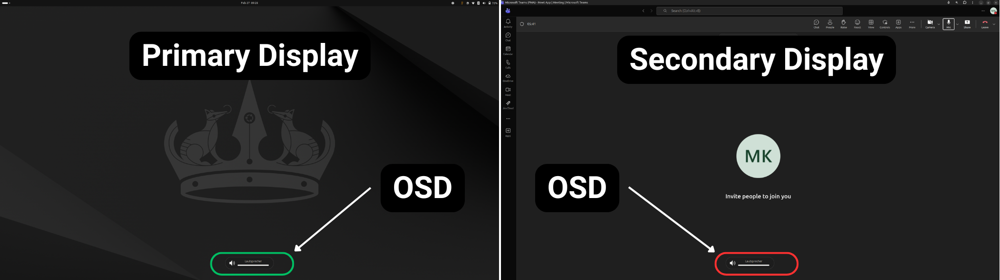
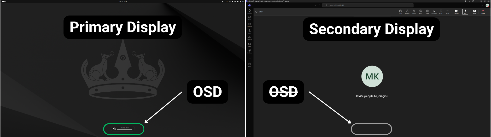

# OSD Primary Only - GNOME Shell Extension


A lightweight GNOME Shell extension that forces **On-Screen Display (OSD) notifications** - like volume, microphone, and brightness overlays - to appear **only on your primary monitor**.

❌ **Default Behavior:** OSD showing on all displays


✅ **After Install:** OSD showing on primary display ONLY 


## 🎯 The Problem it Solves
By default, GNOME mirrors OSD notifications across all connected monitors. If you are screen sharing, recording, or presenting on a secondary display, these overlays can interrupt your clean feed. This extension intercepts the internal GNOME API to route all OSD calls strictly to the primary display.

## ✨ Features
- **Zero Configuration:** Install it, and it just works.
- **Wayland & X11 Compatible:** Hooks directly into GNOME's `osdWindowManager`.
- **Failsafe Design:** Built with error boundaries so API changes in future GNOME versions won't crash your shell.

## 📦 Installation

### Option 1: Official GNOME Extensions (Recommended)
➡️ **Install from GNOME Extensions (E.G.O):** [OSD Primary Only](https://extensions.gnome.org/extension/9458/osd-primary-only/)

### Option 2: Manual / Development
1. Clone this repository:
   ```bash
   git clone https://github.com/mxkramb/gnome-shell-extension-osd-primary-only.git
   ```
2. Build the extension bundle:
   ```bash
   zip -r osd-primary-only@mxkramb.github.io.zip extension.js metadata.json LICENSE README.md
   ```
3. Install the generated `.zip` file:
   ```bash
   gnome-extensions install osd-primary-only@mxkramb.github.io.zip
   ```
4. Depending on your Display Server:  
   - **Wayland:** Log out and log back in  
   - **X11:** Restart GNOME Shell via Alt+F2, type `r`, Enter  
  
   Then enable the extension via the *Extensions* app.
   ```bash
   gnome-extensions enable osd-primary-only@mxkramb.github.io
   ```

## 🧪 Quality Assurance & Testing
This project follows strict code quality guidelines:
- Code is statically analyzed and verified via **ESLint** (ES6+ standard) to ensure stable execution.
- CI pipelines automatically validate code integrity on every push.

**Testing Matrix:**
- ✅ GNOME 46 (Ubuntu 24.04 LTS) - Wayland & X11
- ✅ GNOME 47 (Fedora 41) - Wayland
- ✅ Multi-monitor setups (2 and 3 displays)
- ✅ Validated behavior during screen sharing (WebRTC/OBS)

## 🛠️ Technical Details (For Developers)
This extension uses monkey-patching on `Main.osdWindowManager._showOsdWindow`. It intercepts the call, overrides the target monitor index with `Main.layoutManager.primaryIndex`, and applies the original function using `.call()`.

## 📜 License
This project is licensed under the [MIT License](LICENSE).
